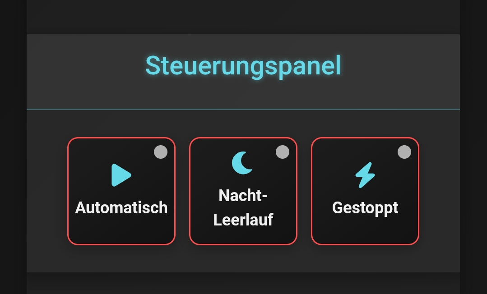

# Zeus Charge Control / Zeus Ladeoptimierung

**Zeus Charge Control** ist eine leistungsstarke Java-Anwendung zur Optimierung von Ladeplänen für PV-Batteriespeicher basierend auf dynamischen Marktpreisen. Durch die Integration von Wetter- und Preisdaten maximiert sie die Effizienz des Ladevorgangs. Voraussetzung ist ein Batteriespeicher mit **Sonnen API v2**.

---

## Hauptfunktionen

- **Batteriestatus-Überwachung**: Echtzeit-Visualisierung des Ladezustands (RSOC) mit grafischer Darstellung.
- **Marktpreismanagement**: Automatische Anpassung der Ladezeiten an Marktpreise mit konfigurierbaren Schwellenwerten.
- **Optimierte Ladezeiten**: Priorisierung der günstigsten Zeitfenster basierend auf Preis und RSOC-Bedarf.
- **Preisvisualisierung**: Diagramme zur Darstellung der Marktpreise und Ladezeiten.
- **Wetterintegration**: Ladeentscheidungen unter Berücksichtigung von Wetterdaten (z. B. Bewölkungsgrad).
- **Nachtmodus-Steuerung**: Konfigurierbarer Nachtmodus (Idle oder Automatik) zur Optimierung des Batterieverhaltens.

---

## Dynamische Ladeplanung

1. **RSOC-basierte Planung**: Keine Ladung, wenn RSOC ≥ Zielwert (z. B. 90 %); bestehende Pläne werden entfernt.
2. **Preisoptimierung**: Auswahl der günstigsten Perioden innerhalb eines Zeitfensters (z. B. 22:00 bis 06:00).
3. **Dynamische Nachtplanung**: Bis zu zwei Perioden, dynamisch angepasst an RSOC-Bedarf.
4. **Tagpufferung**: Zusätzliche Tagzeiten werden bei Bedarf berücksichtigt.
5. **Preisflexibilität**: Toleranz bei leicht höheren Preisen (steuerbar).
6. **Konfigurierbarkeit**: Alle Parameter über `application.properties` anpassbar.

---

## API-Integration

- **Marktpreise**: `awattar`, `tibber`
- **Wetterdaten**: [Open-Meteo API](https://open-meteo.com/) (nicht-kommerzielle Nutzung kostenlos)

> **Hinweis**: Für kommerzielle Nutzung der Open-Meteo API ist ein API-Schlüssel erforderlich.

---

## Visualisierungen

### Batteriestatus


### Steuerungspanel


### Marktpreise (Tabelle & Chart)


---

## Konfiguration (Auszug)

```properties
battery.target.stateOfCharge=90
marketdata.source=awattar
marketdata.acceptable.price.cents=15
marketdata.price.flexibility.threshold=10
night.start=22
night.end=6
nighttime.max.periods=2
```

---

## Lizenz

Zeus Charge Control steht unter der **Apache License, Version 2.0**. Siehe `LICENSE` für Details.

---

# Zeus Charge Control (English)

**Zeus Charge Control** is a powerful Java application for optimizing charging schedules for PV battery systems based on dynamic market prices. It integrates weather and pricing data to maximize efficiency. A battery storage unit with **Sonnen API v2** is required.

---

## Main Features

- **Battery Monitoring**: Real-time RSOC with graphical display.
- **Market Price Control**: Dynamic scheduling based on price thresholds.
- **Optimized Scheduling**: Prioritizes cheapest periods based on RSOC needs.
- **Chart Visualization**: Market price and schedule charts included.
- **Weather Awareness**: Forecast data impacts charge decision-making.
- **Night Mode Control**: Manual or automatic night behavior toggle.

---

## Dynamic Charging Logic

1. **RSOC Logic**: No charging if RSOC ≥ target (e.g., 90%).
2. **Cheapest Selection**: Pick cheapest night periods (e.g., 22:00–06:00).
3. **Night Flexibility**: Up to two periods dynamically chosen.
4. **Day Buffering**: Optional daytime periods are considered if needed.
5. **Flexibility Thresholds**: Tolerate slightly higher prices.
6. **Full Configuration**: Tune all options via `application.properties`.

---

## API Integration

- **Market Prices**: `awattar`, `tibber`
- **Weather**: [Open-Meteo](https://open-meteo.com/) (free for non-commercial use)

> **Note**: Commercial use of Open-Meteo requires a license key.

---

## Visualizations

### Battery Status


### Control Panel


### Market Prices (Table & Chart)


---

## License

Licensed under the **Apache License, Version 2.0**. See `LICENSE` file for full terms.

