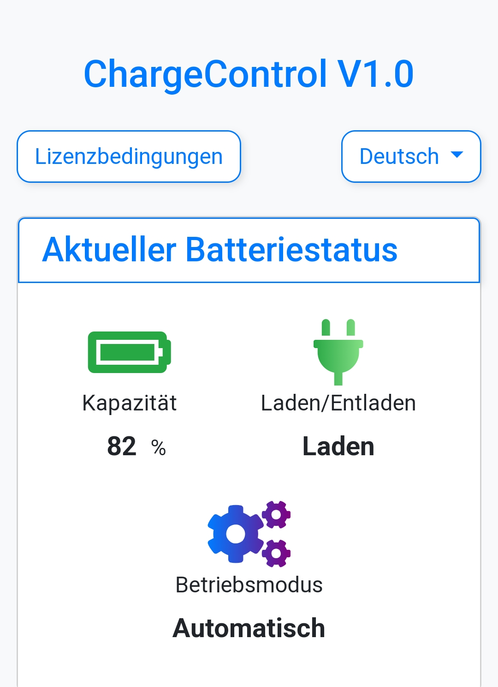
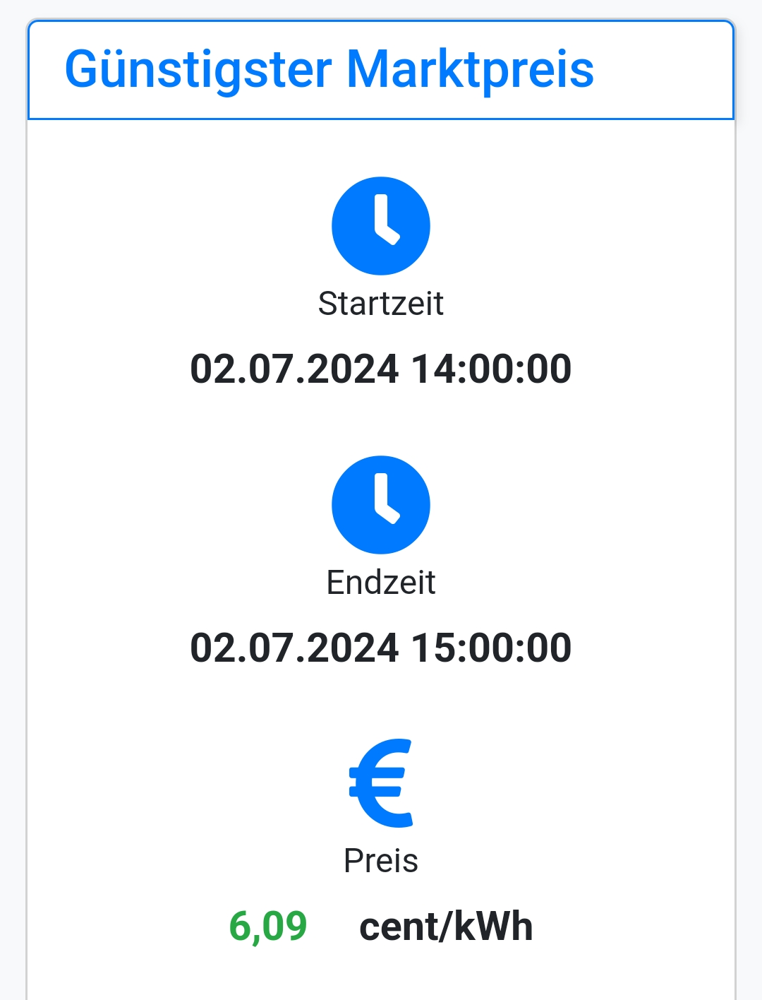
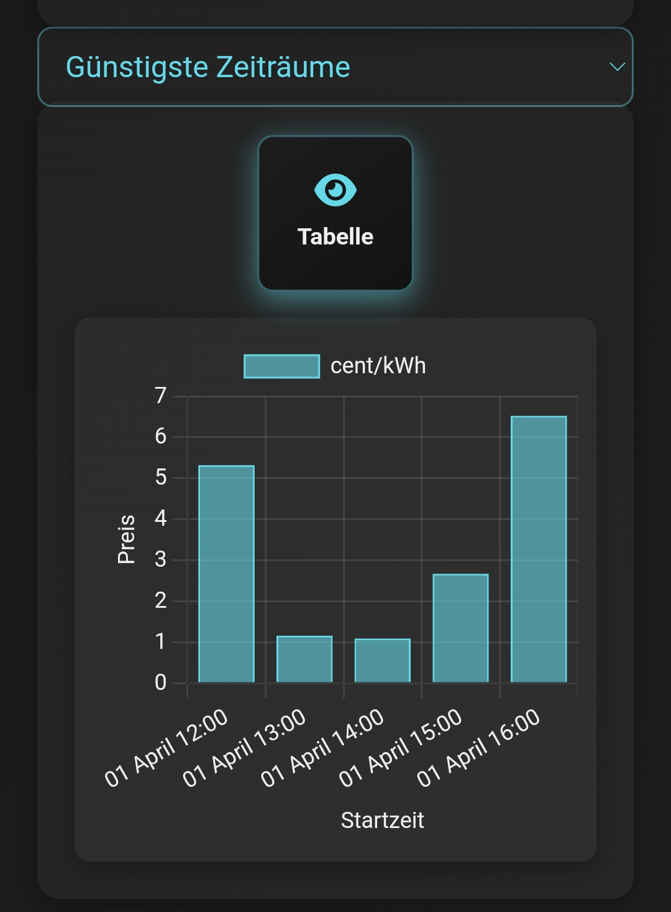

# Zeus Charge Control

Zeus Charge Control - Eine Java-Anwendung zur Verwaltung von Ladeplänen für PV-Batteriespeicher basierend auf Marktpreisen. Diese Anwendung unterstützt die Sonnen API v2 für das Batteriemanagement.

## Funktionen

- **Batteriestatus**: Überwache den aktuellen Status deiner Batterie.
- **Bester Preis im Zeitrahmen**: Identifiziere die besten Marktpreise zum Laden innerhalb eines festgelegten Zeitraums.
- **Preisdiagramm**: Visualisiere Marktpreise über die Zeit hinweg.

## Change-Log

- **Feature**: Akku sofort über das Netz aufladen (Start/Stop)
- **Bugfix**: Batterie in Leerlauf von Betriebsmodus 'Manuell' in 'Automatisch' zurück versetzen.
- **Bugfix**: Ein nicht konfiguriertes oder falsch konfiguriertes Ladesystem führte dazu, dass die Anwendung nicht gestartet werden konnte.

## Enthaltene Dateien

- `zeus-charge-control-1.1.jar`: Die ausführbare JAR-Datei.
- `zeus-charge-control.bat`: Windows-Skript zum Setzen von Umgebungsvariablen und zum Starten der Anwendung.
- `zeus-charge-control.sh`: Linux-Skript zum Setzen von Umgebungsvariablen und zum Starten der Anwendung.
- `license_de.html`: Lizenzdatei auf Deutsch.
- `license_en.html`: Lizenzdatei auf Englisch.
- `LICENSE`: Lizenzdatei im Klartext.

## Nutzung

### Windows

1. Bearbeite `zeus-charge-control.bat`, um die Umgebungsvariablen festzulegen.
2. Doppelklicke auf `zeus-charge-control.bat`, um die Anwendung zu starten.

### Linux

1. Bearbeite `zeus-charge-control.sh`, um die Umgebungsvariablen festzulegen.
2. Mache das Skript ausführbar:
   ```sh
   chmod +x zeus-charge-control.sh
   ```
3. Führe das Skript aus:
   ```sh
   ./zeus-charge-control.sh
   ```

### Service

Der Service kann über http://localhost:8080/charging-status aufgerufen werden.

### Binärdatei herunterladen

Du kannst die neueste Version von Zeus Charge Control über den folgenden Link herunterladen:

[Zeus Charge Control v1.1](https://github.com/gzeuner/zeus-charge-control/releases/download/v1.1/zeus-charge-control.zip)

## Screenshots

Hier sind einige Screenshots der Anwendung in Aktion:

**Batteriestatus**



**Bester Preis im Zeitrahmen**



**Preisdiagramm**



## Anforderungen

Die Batterie muss die Sonnen API v2 unterstützen. Andere APIs werden derzeit nicht unterstützt.

Java 16 und höher.

### Binärdatei herunterladen

Du kannst die neueste Version von Zeus Lade-Kontrolle über den folgenden Link herunterladen:

[Zeus Charge Control v1.1](https://github.com/gzeuner/zeus-charge-control/releases/download/v1.1/zeus-charge-control.zip)

### Umgebungsvariablen und ihre Bedeutung

Unsere Anwendung verwendet eine Vielzahl von Umgebungsvariablen, um sich flexibel an unterschiedliche Konfigurationen und Szenarien anzupassen. Hier sind einige der wichtigsten Variablen und ihre Bedeutungen:

- **SERVER_ADDRESS**: Diese Variable gibt die IP-Adresse an, unter der der Server Anfragen entgegennimmt. Standardmäßig ist sie auf `0.0.0.0` gesetzt, was bedeutet, dass der Server auf allen verfügbaren Netzwerkadressen lauscht.

- **SERVER_PORT**: Diese Variable legt den Port fest, auf dem der Server läuft. Der Standardwert ist `8080`.

- **BATTERY_URL**: Die URL der Batterie-API. Diese API wird verwendet, um den aktuellen Status der Batterie abzufragen und Ladebefehle zu senden.

- **BATTERY_AUTH_TOKEN**: Das Authentifizierungstoken für die Batterie-API. Dieses Token ist erforderlich, um autorisierte Anfragen an die API zu senden.

- **BATTERY_TARGET_STATE_OF_CHARGE**: Diese Variable gibt den Ziel-Ladezustand der Batterie in Prozent an. Sie bestimmt, bis zu welchem Ladezustand die Batterie geladen werden soll. Sobald dieser Wert erreicht ist, stoppt der Ladevorgang. Wenn diese Variable nicht gesetzt ist, wird ein Standardwert von 100 % verwendet.

- **BATTERY_CHARGING_POINT**: Diese Variable gibt den Ladepunkt der Batterie in Watt an. Sie bestimmt die Leistung, mit der die Batterie geladen werden soll, um ein optimales Gleichgewicht zwischen Ladezeit und Energieeffizienz zu erreichen. Wenn diese Variable nicht gesetzt ist, wird ein Standardwert von 4000 W verwendet.

- **AWATTAR_MARKETDATA_URL**: Die URL des aWATTar-Marktpreis-Dienstes. Diese URL wird verwendet, um aktuelle und zukünftige Strompreise von aWATTar abzurufen.

- **AWATTAR_AUTH_TOKEN**: Das Authentifizierungstoken für den aWATTar-Marktpreis-Dienst. Derzeit stellt aWATTar Preise öffentlich nach dem Prinzip der fairen Nutzung ohne Zugangsbeschränkungen zur Verfügung.

- **TIBBER_MARKETDATA_URL**: Die URL des Tibber-Marktpreis-Dienstes. Diese URL wird verwendet, um aktuelle und zukünftige Strompreise von Tibber abzurufen.

- **TIBBER_AUTH_TOKEN**: Das Authentifizierungstoken für den Tibber-Marktpreis-Dienst. Dieses Token ist erforderlich, um autorisierte Anfragen an die Tibber-API zu senden. Tibber-Kunden können Strompreise von der Tibber-API beziehen.

- **MARKETDATA_SOURCE**: Diese Variable gibt an, welche Datenquelle für Marktpreise verwendet werden soll. Mögliche Werte sind `awattar` oder `tibber`. Je nach ausgewählter Quelle wird die Anwendung Marktpreise entweder von aWATTar oder Tibber abrufen.

## Lizenz

Diese Software wird unter einer proprietären Lizenz bereitgestellt.

Sie enthält Software, die vom Spring Boot-Projekt entwickelt wurde <a href="http://spring.io/projects/spring-boot">(http://spring.io/projects/spring-boot)</a>.
Spring Boot-Komponenten sind unter der Apache License, Version 2.0 lizenziert <a href="http://www.apache.org/licenses/LICENSE-2.0">(http://www.apache.org/licenses/LICENSE-2.0)</a>.

Details zur Lizenz findest du in `LICENSE.txt`, `license_de.html` oder `license_en.html`.

Für weitere Informationen, siehe bereitgestellte Lizenzdateien.

--

# Zeus Charge Control

Zeus Charge Control - A Java application for managing battery charging schedules based on market prices. This application supports the Sonnen API v2 for battery management.

## Features

- **Battery Status**: Monitor the current status of your battery.
- **Best Price in Scope**: Identify the best market prices for charging within a specified timeframe.
- **Price Chart**: Visualize market prices over time.

## Change-Log
- **Feature**: Charge the battery immediately via the grid (start/stop)
- **Bugfix**: Reset battery in idle mode from 'Manual' to 'Automatic' operating mode.
- **Bugfix**: An unconfigured or incorrectly configured loading system caused the application not to start.

## Files Included

- `zeus-charge-control-1.1.jar`: The main executable JAR file.
- `zeus-charge-control.bat`: Windows script to set environment variables and run the application.
- `zeus-charge-control.sh`: Linux script to set environment variables and run the application.
- `license_de.html`: License file in German.
- `license_en.html`: License file in English.
- `LICENSE`: License file in plain text.

## Usage

### Windows

1. Edit `zeus-charge-control.bat` to set the environment variables.
2. Double-click `zeus-charge-control.bat` to run the application.

### Linux

1. Edit `zeus-charge-control.sh` to set the environment variables.
2. Make the script executable:
   ```sh
   chmod +x zeus-charge-control.sh
   ```
3. Run the script:
   ```sh
   ./zeus-charge-control.sh
   ```
### Service

The Service can be accessed via http://localhost:8080/charging-status

### Download Binary

You can download the latest version of Zeus Charge Control from the following link:

[Zeus Charge Control v1.1](https://github.com/gzeuner/zeus-charge-control/releases/download/v1.1/zeus-charge-control.zip)

## Screenshots

Here are some screenshots of the application in action:

**Battery Status**


**Best Price in Scope**


**Price Chart**


## Requirements

The battery must support the Sonnen API v2. Other APIs are currently not supported.

Java 16 and above.

### Download Binary

You can download the latest version of Zeus Charge Control from the following link:

[Zeus Charge Control v1.1](https://github.com/gzeuner/zeus-charge-control/releases/download/v1.1/zeus-charge-control.zip)

### Environment Variables and Their Significance

Our application uses a variety of environment variables to adapt flexibly to different configurations and scenarios. Here are some of the most important variables and their meanings:

- **SERVER_ADDRESS**: This variable specifies the IP address on which the server accepts requests. By default, it is set to `0.0.0.0`, which means the server listens on all available network addresses.

- **SERVER_PORT**: This variable sets the port on which the server runs. The default value is `8080`.

- **BATTERY_URL**: The URL of the battery API. This API is used to query the current status of the battery and send charging commands.

- **BATTERY_AUTH_TOKEN**: The authentication token for the battery API. This token is required to send authorized requests to the API.

- **BATTERY_TARGET_STATE_OF_CHARGE**: This variable specifies the target state of charge of the battery in percentage. It determines up to what state of charge the battery should be charged. Once this value is reached, the charging process stops. If this variable is not set, a default value of 100% is used.

- **BATTERY_CHARGING_POINT**: This variable specifies the charging point of the battery in watts. It determines the power at which the battery should be charged to achieve an optimal balance between charging time and energy efficiency. If this variable is not set, a default value of 4000 W is used.

- **AWATTAR_MARKETDATA_URL**: The URL of the aWATTar market price service. This URL is used to retrieve current and future electricity prices from aWATTar.

- **AWATTAR_AUTH_TOKEN**: The authentication token for the aWATTar market price service. Currently, aWATTar provides prices publicly under the fair use principle without access restrictions.

- **TIBBER_MARKETDATA_URL**: The URL of the Tibber market price service. This URL is used to retrieve current and future electricity prices from Tibber.

- **TIBBER_AUTH_TOKEN**: The authentication token for the Tibber market price service. This token is required to send authorized requests to the Tibber API. Tibber customers can obtain electricity prices from the Tibber API.

- **MARKETDATA_SOURCE**: This variable specifies which data source to use for market prices. Possible values are `awattar` or `tibber`. Depending on the selected source, the application will retrieve market prices either from aWATTar or Tibber.


## License

This software is provided under a proprietary license.

It includes software developed by the Spring Boot project <a href="http://spring.io/projects/spring-boot">(http://spring.io/projects/spring-boot)</a>.
Spring Boot components are licensed under the Apache License, Version 2.0 <a href="http://www.apache.org/licenses/LICENSE-2.0">(http://www.apache.org/licenses/LICENSE-2.0)</a>

For license details, see `LICENSE.txt`, `license_de.html`, or `license_en.html`.

For more details, refer to the provided license files.
