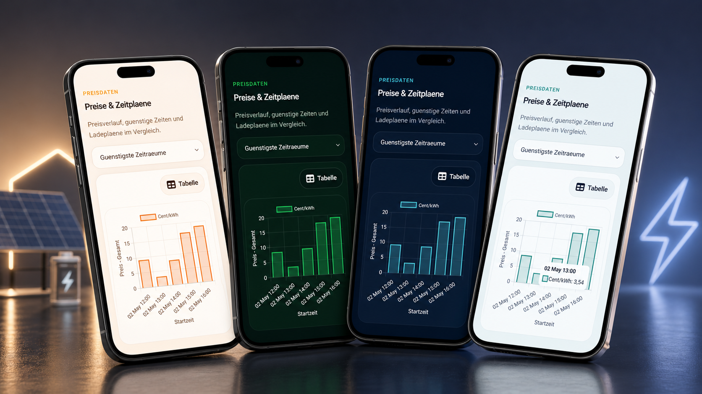

# ⚡ Zeus Charge Control


**Intelligente Ladeplanung für PV-Batteriespeicher – automatisch zu günstigen Strompreis-Zeiten.**

**Smart charging control for PV battery storage systems – automatically using low-price electricity windows.**

---



> 💡 Dynamische Strompreise, automatische Ladeplanung und moderne Web-UI – gebündelt in einer Anwendung.  
> 💡 Dynamic electricity prices, automated charging logic and a modern web UI – bundled into one application.

---

# 🇩🇪 Deutsche Dokumentation

## ⚠️ Wichtiger Hinweis

**Zeus Charge Control unterstützt aktuell ausschließlich PV-Batteriespeicher mit Sonnen API v2.**

Andere Batteriespeicher, Wechselrichter oder Energiemanagementsysteme werden derzeit nicht unterstützt.

👉 **Produktiver Einsatz kann möglich sein, erfolgt aber immer eigenverantwortlich.**  
Ob die Anwendung für die eigene Anlage geeignet ist, hängt von der konkreten Installation, der Konfiguration, den verfügbaren Schnittstellen und dem laufenden Monitoring durch den Betreiber ab.

Konfiguration, Monitoring und Bewertung der automatisierten Ladeentscheidungen liegen beim jeweiligen Betreiber der Installation.

---

## 🧠 Was ist Zeus Charge Control?

**Zeus Charge Control** ist eine **Java-/Spring-Boot-Anwendung** zur intelligenten Ladeplanung eines PV-Batteriespeichers.

Die Anwendung nutzt dynamische Strompreise, den aktuellen Batteriezustand und optional Wetterdaten, um günstige Ladezeitfenster zu erkennen und den Speicher entsprechend zu steuern.

Kurz gesagt:  
**Wenn Strom besonders günstig ist, kann Zeus Charge Control den Speicher gezielt laden – sofern deine Konfiguration und deine Anlage dazu passen.**

---

## 👥 Für wen ist dieses Projekt gedacht?

Zeus Charge Control richtet sich an technisch versierte Betreiber eines unterstützten PV-Batteriespeichers mit **Sonnen API v2**, die dynamische Strompreise nutzen und ihre Ladeplanung eigenverantwortlich automatisieren möchten.

Geeignet ist das Projekt insbesondere für Nutzerinnen und Nutzer, die:

- einen unterstützten Sonnen-PV-Batteriespeicher betreiben
- Zugriff auf die Sonnen API v2 ihrer Anlage haben
- dynamische Stromtarife oder Marktpreisdaten nutzen möchten
- technische Konfigurationen sicher einschätzen können
- bereit sind, den Betrieb der Anwendung aktiv zu überwachen

Nicht geeignet ist das Projekt für Personen, die eine universelle Plug-and-play-Lösung ohne technische Prüfung, Konfiguration oder Monitoring erwarten.

---

## 🔋 Unterstützte Grundlage

Aktuell technisch unterstützt:

- ✅ PV-Batteriespeicher mit **Sonnen API v2**

Derzeit nicht unterstützt:

- ❌ andere Batteriespeicher ohne Sonnen API v2
- ❌ universelle Wechselrichtersteuerung
- ❌ vollständige Energiemanagementsysteme
- ❌ sicherheitskritische oder netzrelevante Steuerungsfunktionen

---

## 🚫 Was Zeus Charge Control nicht macht

Zeus Charge Control ist kein vollständiges Energiemanagementsystem und ersetzt keine fachliche Prüfung der eigenen Anlage.

Die Anwendung:

- garantiert keine Stromkostenersparnis
- erkennt nicht automatisch jede technische Besonderheit deiner Installation
- ersetzt kein Monitoring durch den Betreiber
- ist keine offizielle Software der Sonnen GmbH
- ist nicht für sicherheitskritische, medizinische oder netzrelevante Steuerungsaufgaben gedacht
- ersetzt keine zertifizierte Steuerung oder fachkundige Bewertung

---

## 🚀 Features

- ⚡ Dynamische Ladeplanung anhand von Strompreisen
- 📉 Optimierung auf günstige Marktpreis-Zeiträume
- 🔋 Steuerung unter Berücksichtigung des Batteriezustands
- 🌤️ Optionale Wetterintegration
- 🎛️ Manuelle Steuerung über die Web-UI
- 🎨 Mehrere moderne UI-Themes
- 🔄 Event- und zeitgesteuerte Re-Optimierung
- 🛡️ Robustes Verhalten bei API- oder Datenproblemen

---

## 🔧 Batterie-Konfiguration

Die Anwendung muss an deine reale Batterie angepasst werden. Besonders wichtig sind die Adresse deiner Batterie, die Authentifizierung und die technischen Leistungsdaten.

```properties
battery.url=${BATTERY_URL:}
battery.authToken=${BATTERY_AUTH_TOKEN:}

battery.inverter.max.watts=${BATTERY_INVERTER_MAX_WATTS:4600}
battery.max.capacity.wh=${BATTERY_MAX_CAPACITY_WH:10000}
```

### Was bedeuten diese Werte?

| Einstellung | Bedeutung |
|---|---|
| `battery.url` | Adresse deiner Sonnen-Batterie im lokalen Netzwerk oder erreichbaren Netz |
| `battery.authToken` | Token für den Zugriff auf die Sonnen API |
| `battery.inverter.max.watts` | Maximale Lade-/Entladeleistung des Wechselrichters in Watt |
| `battery.max.capacity.wh` | Nutzbare oder konfigurierte Batteriekapazität in Wattstunden |

👉 **Diese Werte müssen zu deiner realen Installation passen.**  
Falsche Kapazitäten, falsche Leistungswerte oder eine falsche API-Adresse können zu unzuverlässigen Ladeentscheidungen führen.

---

## 📊 RSOC – was ist das?

**RSOC** steht für **Relative State of Charge**.

Gemeint ist der aktuelle Ladezustand der Batterie in Prozent.

Beispiel:

- `RSOC = 20 %` → Batterie ist weitgehend leer
- `RSOC = 80 %` → Batterie ist gut gefüllt
- `RSOC = 100 %` → Batterie ist vollständig geladen

Zeus Charge Control nutzt diesen Wert, um Ladeentscheidungen zu treffen und Ladevorgänge automatisch zu beenden, wenn der Ziel-Ladezustand erreicht ist.

---

## ⚙️ Kernlogik

### 🔋 Dynamische Ladeplanung

Zeus Charge Control sucht günstige Strompreis-Zeitfenster und plant daraus mögliche Ladephasen.

Dabei werden unter anderem berücksichtigt:

- aktuelle und kommende Strompreise
- aktueller Ladezustand der Batterie
- konfigurierte Batteriekapazität
- maximale Ladeleistung
- optional verfügbare Wetterdaten

---

### 🔁 Automatische Re-Optimierung

Die Ladeplanung wird regelmäßig neu bewertet, zum Beispiel:

- bei neuen Preisupdates
- stündlich per Scheduler
- bei relevanten Zustandsänderungen der Batterie

So kann die Anwendung auf veränderte Preise, API-Daten oder Batteriezustände reagieren.

---

### 🧹 Automatische Entfernung geplanter Ladefenster

Zeus Charge Control kann geplante oder aktive Ladefenster automatisch entfernen beziehungsweise beenden, wenn sie nicht mehr sinnvoll sind.

Das kann zum Beispiel passieren, wenn:

- der gewünschte Ziel-RSOC bereits erreicht wurde
- ein Ladefenster abgelaufen ist
- neue Strompreise eine bessere Planung ermöglichen
- die Batterie oder API andere Zustände meldet als erwartet

**Warum ist das wichtig?**  
Ohne diese Bereinigung könnten alte oder überholte Ladeentscheidungen bestehen bleiben. Die automatische Entfernung sorgt dafür, dass die Planung aktuell bleibt und nicht unnötig weitergeladen wird.

---

## 📦 Voraussetzungen

- Java 21
- Maven 3.9 oder neuer
- PV-Batteriespeicher mit Sonnen API v2
- gültige lokale Konfiguration für Batterie, Strompreise und optionale Dienste

---

## ▶️ Build & Start

### Build

```bash
mvn clean verify
```

### Start im Entwicklungsmodus

```bash
mvn spring-boot:run
```

### Start als JAR

```bash
java -jar target/zeus-charge-control-3.0-RELEASE.jar
```

---

## 🖥️ Web-UI

Zeus Charge Control stellt eine Weboberfläche bereit, über die Ladeplanung, Statusinformationen und manuelle Steuerungen sichtbar beziehungsweise bedienbar sind.

Je nach Konfiguration zeigt die UI unter anderem:

- Batteriestatus
- aktuelle Ladeentscheidung
- Strompreis-Zeitfenster
- geplante Ladephasen
- Systemstatus
- Theme-Auswahl

---

## 🛡️ Stabilität & Fehlertoleranz

Die Anwendung ist darauf ausgelegt, bei externen Problemen möglichst kontrolliert zu reagieren.

Typische externe Fehlerquellen sind:

- nicht erreichbare Batterie-API
- fehlende oder fehlerhafte Strompreisdaten
- Ausfälle externer Dienste
- Netzwerkprobleme
- unvollständige Konfiguration

Trotzdem gilt:  
**Automatisierte Steuerung ersetzt kein Monitoring.** Der Betreiber sollte die Anlage regelmäßig prüfen.

---

## ⚠️ Rechtlicher Hinweis / Disclaimer

### Kein Produkt der Sonnen GmbH

Dieses Projekt steht in **keiner Verbindung zur Sonnen GmbH**.

Die Software:

- wurde **nicht** von der Sonnen GmbH entwickelt
- wird **nicht** von der Sonnen GmbH bereitgestellt
- wird **nicht** von der Sonnen GmbH unterstützt
- ist **kein offizielles Produkt** der Sonnen GmbH
- steht in **keinem Affiliate-, Partner- oder Sponsoring-Verhältnis** zur Sonnen GmbH

Alle Marken, Produktnamen und Unternehmensnamen gehören den jeweiligen Rechteinhabern und werden ausschließlich beschreibend verwendet.

Die Verwendung der Sonnen API erfolgt auf Grundlage der vom jeweiligen Betreiber eingerichteten und zugänglichen Schnittstellen. Der Betreiber ist selbst dafür verantwortlich, die Nutzungsbedingungen, technischen Vorgaben und rechtlichen Rahmenbedingungen der eingesetzten Schnittstellen einzuhalten.

---

### Nutzung auf eigene Verantwortung

Die Nutzung von Zeus Charge Control erfolgt **ausschließlich auf eigene Verantwortung**.

Der Betreiber der Installation ist insbesondere verantwortlich für:

- korrekte Konfiguration der Anwendung
- Prüfung der technischen Eignung der eigenen Anlage
- Überwachung des Betriebs
- Bewertung der automatisierten Ladeentscheidungen
- Einhaltung gesetzlicher, vertraglicher und technischer Vorgaben
- Prüfung möglicher Auswirkungen auf Garantie, Gewährleistung, Versicherung oder Herstellervorgaben

Automatisierte Steuerungen können unerwartetes Verhalten verursachen, insbesondere bei:

- fehlerhaften Konfigurationen
- falschen Leistungs- oder Kapazitätswerten
- unvollständigen oder fehlerhaften Marktdaten
- API-Ausfällen
- Kommunikationsproblemen
- Änderungen an externen Schnittstellen
- Firmware- oder Softwareänderungen am Batteriesystem

---

### Keine Gewährleistung

Diese Software wird **„wie sie ist“ („as is“) und ohne Gewährleistung** bereitgestellt.

Es wird insbesondere keine Gewähr übernommen für:

- Richtigkeit, Vollständigkeit oder Aktualität von Marktdaten
- Verfügbarkeit externer APIs oder Dienste
- fehlerfreie oder unterbrechungsfreie Funktion
- wirtschaftliche Vorteile oder Stromkosteneinsparungen
- technische Eignung für einen bestimmten Zweck
- Kompatibilität mit bestimmten Anlagen, Firmwareständen oder API-Versionen

---

### Haftungsbeschränkung

Soweit gesetzlich zulässig, ist eine Haftung der Projektbeteiligten für Schäden ausgeschlossen, die aus der Nutzung, Fehlkonfiguration oder Nichtverfügbarkeit der Software entstehen.

Dies umfasst insbesondere:

- Datenverluste
- Fehlfunktionen der Ladeplanung
- wirtschaftliche Nachteile
- höhere Stromkosten
- technische Störungen
- Betriebsunterbrechungen
- Schäden durch fehlerhafte oder unerwartete Steuerungsentscheidungen

Gesetzlich zwingende Haftungstatbestände bleiben unberührt.

---

### Kein Einsatz in sicherheitskritischen Bereichen

Zeus Charge Control ist **nicht für sicherheitskritische, medizinische, netzrelevante oder anderweitig kritische Anwendungen geeignet**.

Die Anwendung dient der privaten beziehungsweise eigenverantwortlichen Optimierung eines unterstützten PV-Batteriespeichers. Sie ersetzt keine zertifizierte Steuerung, kein Energiemanagementsystem mit Sicherheitsfunktion und keine fachliche Prüfung durch qualifizierte Personen.

---

## 📄 Lizenz

Dieses Projekt steht unter der **Apache License 2.0**.

Details findest du in der Lizenzdatei des Projekts.

---

# 🇬🇧 English Documentation

## ⚠️ Important Notice

**Zeus Charge Control currently supports only PV battery storage systems with Sonnen API v2.**

Other battery storage systems, inverters or energy management systems are currently not supported.

👉 **Production use may be possible, but it is always at the operator's own responsibility.**  
Whether this application is suitable for a specific installation depends on the actual system, configuration, available interfaces and ongoing monitoring by the operator.

Configuration, monitoring and evaluation of automated charging decisions are the responsibility of the respective system operator.

---

## 🧠 What is Zeus Charge Control?

**Zeus Charge Control** is a **Java/Spring Boot application** for intelligent charging control of a PV battery storage system.

The application uses dynamic electricity prices, the current battery state and optional weather data to identify low-price charging windows and control the battery accordingly.

In short:  
**When electricity is particularly cheap, Zeus Charge Control can charge the battery in a targeted way – provided your configuration and installation are suitable.**

---

## 👥 Who is this project for?

Zeus Charge Control is intended for technically experienced operators of supported PV battery storage systems with **Sonnen API v2** who want to use dynamic electricity prices and automate charging decisions under their own responsibility.

The project is especially suitable for users who:

- operate a supported Sonnen PV battery storage system
- have access to the Sonnen API v2 of their installation
- want to use dynamic electricity tariffs or market price data
- can safely evaluate technical configuration parameters
- are willing to actively monitor the application during operation

This project is not intended for users expecting a universal plug-and-play solution without technical verification, configuration or monitoring.

---

## 🔋 Supported Basis

Currently technically supported:

- ✅ PV battery storage systems with **Sonnen API v2**

Currently not supported:

- ❌ other battery storage systems without Sonnen API v2
- ❌ universal inverter control
- ❌ full energy management systems
- ❌ safety-critical or grid-relevant control functions

---

## 🚫 What Zeus Charge Control does not do

Zeus Charge Control is not a full energy management system and does not replace professional verification of your own installation.

The application:

- does not guarantee electricity cost savings
- does not automatically detect every technical detail of your installation
- does not replace monitoring by the operator
- is not official software from Sonnen GmbH
- is not intended for safety-critical, medical or grid-relevant control tasks
- does not replace certified control systems or qualified professional assessment

---

## 🚀 Features

- ⚡ Dynamic charging planning based on electricity prices
- 📉 Optimization for low-price market periods
- 🔋 Control logic that considers the current battery state
- 🌤️ Optional weather integration
- 🎛️ Manual control via the web UI
- 🎨 Multiple modern UI themes
- 🔄 Event-based and scheduled re-optimization
- 🛡️ Robust behavior in case of API or data problems

---

## 🔧 Battery Configuration

The application must be adapted to your real battery installation. The battery address, authentication and technical performance values are especially important.

```properties
battery.url=${BATTERY_URL:}
battery.authToken=${BATTERY_AUTH_TOKEN:}

battery.inverter.max.watts=${BATTERY_INVERTER_MAX_WATTS:4600}
battery.max.capacity.wh=${BATTERY_MAX_CAPACITY_WH:10000}
```

### What do these values mean?

| Setting | Meaning |
|---|---|
| `battery.url` | Address of your Sonnen battery in the local or reachable network |
| `battery.authToken` | Token for accessing the Sonnen API |
| `battery.inverter.max.watts` | Maximum charging/discharging power of the inverter in watts |
| `battery.max.capacity.wh` | Usable or configured battery capacity in watt-hours |

👉 **These values must match your real installation.**  
Incorrect capacities, incorrect power values or a wrong API address may result in unreliable charging decisions.

---

## 📊 RSOC – what does it mean?

**RSOC** stands for **Relative State of Charge**.

It describes the current battery state of charge as a percentage.

Example:

- `RSOC = 20 %` → battery is mostly empty
- `RSOC = 80 %` → battery is well charged
- `RSOC = 100 %` → battery is fully charged

Zeus Charge Control uses this value to make charging decisions and to stop charging automatically once the target state of charge has been reached.

---

## ⚙️ Core Logic

### 🔋 Dynamic Charging Planning

Zeus Charge Control searches for low-price electricity windows and plans possible charging phases based on them.

Among other factors, the application considers:

- current and upcoming electricity prices
- current battery state of charge
- configured battery capacity
- maximum charging power
- optional weather data

---

### 🔁 Automatic Re-Optimization

The charging plan is regularly re-evaluated, for example:

- when new price data becomes available
- hourly via scheduler
- when relevant battery state changes occur

This allows the application to react to changing prices, API data or battery states.

---

### 🧹 Automatic Removal of Planned Charging Windows

Zeus Charge Control can automatically remove or stop planned or active charging windows when they are no longer useful.

This may happen, for example, when:

- the desired target RSOC has already been reached
- a charging window has expired
- new electricity prices allow a better plan
- the battery or API reports unexpected states

**Why is this important?**  
Without this cleanup, outdated or obsolete charging decisions could remain active. Automatic removal helps keep the plan current and prevents unnecessary continued charging.

---

## 📦 Requirements

- Java 21
- Maven 3.9 or newer
- PV battery storage system with Sonnen API v2
- valid local configuration for battery, electricity prices and optional services

---

## ▶️ Build & Start

### Build

```bash
mvn clean verify
```

### Start in development mode

```bash
mvn spring-boot:run
```

### Start as JAR

```bash
java -jar target/zeus-charge-control-3.0-RELEASE.jar
```

---

## 🖥️ Web UI

Zeus Charge Control provides a web interface that displays charging plans, status information and manual controls.

Depending on the configuration, the UI may show:

- battery status
- current charging decision
- electricity price windows
- planned charging phases
- system status
- theme selection

---

## 🛡️ Stability & Fault Tolerance

The application is designed to react as safely and predictably as possible to external problems.

Typical external error sources include:

- unreachable battery API
- missing or incorrect electricity price data
- outages of external services
- network problems
- incomplete configuration

Nevertheless:  
**Automated control does not replace monitoring.** The operator should check the system regularly.

---

## ⚠️ Legal Notice / Disclaimer

### Not a product of Sonnen GmbH

This project is **not affiliated with Sonnen GmbH**.

The software:

- was **not** developed by Sonnen GmbH
- is **not** provided by Sonnen GmbH
- is **not** supported by Sonnen GmbH
- is **not** an official product of Sonnen GmbH
- has **no affiliate, partner or sponsorship relationship** with Sonnen GmbH

All trademarks, product names and company names belong to their respective owners and are used for descriptive purposes only.

Use of the Sonnen API is based on the interfaces configured and made accessible by the respective operator. The operator is responsible for complying with the terms of use, technical requirements and legal framework of the interfaces being used.

---

### Use at your own responsibility

Use of Zeus Charge Control is **entirely at your own responsibility**.

The system operator is especially responsible for:

- correct configuration of the application
- verifying the technical suitability of the installation
- monitoring operation
- evaluating automated charging decisions
- complying with legal, contractual and technical requirements
- checking possible effects on warranty, insurance or manufacturer requirements

Automated control may cause unexpected behavior, especially in case of:

- incorrect configuration
- incorrect power or capacity values
- incomplete or incorrect market data
- API outages
- communication problems
- changes to external interfaces
- firmware or software changes in the battery system

---

### No warranty

This software is provided **“as is” and without warranty**.

In particular, no warranty is given for:

- correctness, completeness or timeliness of market data
- availability of external APIs or services
- error-free or uninterrupted operation
- economic benefits or electricity cost savings
- technical suitability for a specific purpose
- compatibility with specific installations, firmware versions or API versions

---

### Limitation of liability

To the extent permitted by law, liability of the project contributors for damages resulting from the use, misconfiguration or unavailability of the software is excluded.

This includes, in particular:

- data loss
- charging plan malfunctions
- economic disadvantages
- higher electricity costs
- technical faults
- operational interruptions
- damage caused by incorrect or unexpected control decisions

Mandatory statutory liability remains unaffected.

---

### No use in safety-critical areas

Zeus Charge Control is **not suitable for safety-critical, medical, grid-relevant or otherwise critical applications**.

The application is intended for private or self-responsible optimization of a supported PV battery storage system. It does not replace certified control systems, energy management systems with safety functions or professional assessment by qualified persons.

---

## 📄 License

This project is licensed under the **Apache License 2.0**.

See the project license file for details.
