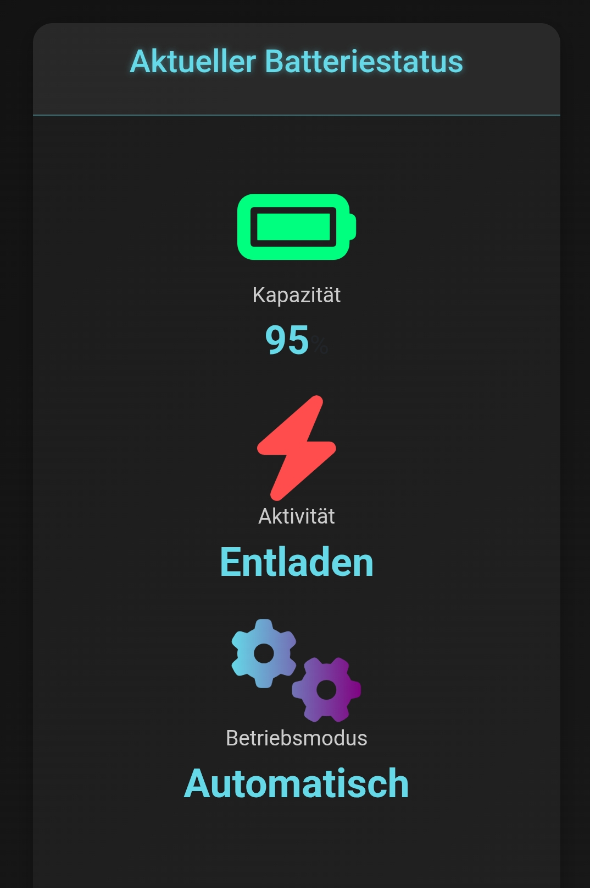

# Zeus Charge Control

**Zeus Charge Control** ist eine leistungsstarke Java-Anwendung zur Optimierung von Ladeplänen für PV-Batteriespeicher basierend auf dynamischen Marktpreisen. Durch die Integration von Wetter- und Preisdaten maximiert sie die Effizienz des Ladevorgangs. Voraussetzung ist ein Batteriespeicher mit **Sonnen API v2**.

---

## Hauptfunktionen

- **Batteriestatus-Überwachung**: Echtzeit-Visualisierung des Ladezustands (RSOC) mit grafischer Darstellung.
- **Marktpreismanagement**: Automatische Anpassung der Ladezeiten an Marktpreise mit konfigurierbaren Schwellenwerten.
- **Optimierte Ladezeiten**: Priorisierung der günstigsten Zeitfenster basierend auf Preis und RSOC-Bedarf.
- **Preisvisualisierung**: Diagramme zur Darstellung der Marktpreise und Ladezeiten.
- **Wetterintegration**: Ladeentscheidungen unter Berücksichtigung von Wetterdaten (z. B. Bewölkungsgrad).
- **Nachtmodus-Steuerung**: Konfigurierbarer Nachtmodus (Idle oder Automatik) zur Optimierung des Batterieverhaltens.

---

## Dynamische Ladeplanung

Zeus Charge Control berücksichtigt mehrere Faktoren für eine präzise und effiziente Ladeplanung:

1. **RSOC-basierte Planung**: Keine Ladung, wenn der Ladezustand den Zielwert (z. B. 90 %) erreicht oder übersteigt; bestehende Pläne werden entfernt.
2. **Preisorientierte Optimierung**: Auswahl der günstigsten Perioden innerhalb eines konfigurierbaren Zeitfensters oder bis zum Ende der Nacht (standardmäßig 22:00 bis 06:00).
3. **Dynamische Nachtplanung**: Planung von bis zu zwei Nachtperioden, wobei die Anzahl dynamisch an den RSOC-Bedarf angepasst wird. Nur die günstigsten Preise werden priorisiert.
4. **Tageszeit-Pufferung**: Zwischenspeicherung günstiger Tagperioden außerhalb der Nachtzeit, falls zusätzliche Ladung nötig ist.
5. **Flexibilitätstoleranz**: Berücksichtigung leicht erhöhter Preise bei Bedarf, gesteuert durch dynamische Preisschwellen.
6. **Individuelle Konfiguration**: Anpassbare Parameter über `application.properties`, z. B. Ziel-RSOC, maximale Nachtperioden und Preisschwellen.

### Beispiel:
- Bei RSOC ≥ 90 % werden keine Ladezeiten geplant, und bestehende Pläne entfernt.
- Bei RSOC < 90 % plant das System dynamisch die günstigsten Perioden, z. B. eine oder zwei Nachtperioden je nach Bedarf.
- Nachts bleibt die Batterie im manuellen Modus, falls `nightChargingIdle` aktiviert ist (steuerbar über die GUI).

---

## API-Integration

- **Marktpreise**: Unterstützte Anbieter sind `awattar` und `tibber`.
- **Wetterdaten**: Die [Open-Meteo API](https://open-meteo.com/) liefert Wettervorhersagen und ist für nicht-kommerzielle Nutzung kostenlos.

> **Hinweis**: Für kommerzielle Anwendungen ist ein API-Schlüssel erforderlich. Details siehe [Nutzungsbedingungen von Open-Meteo](https://open-meteo.com/en/terms).

---

## Screenshots

### Batteriestatus

### Marktpreis-Visualisierung

---

## Konfiguration

### Datenbank
- **`spring.datasource.url`**: URL der Datenbank (Standard: `jdbc:h2:mem:testdb`)
- **`spring.datasource.username`**: Benutzername (Standard: `sa`)
- **`spring.datasource.password`**: Passwort (Standard: `password`)

### Ladeeinstellungen
- **`battery.target.stateOfCharge`**: Ziel-Ladezustand in Prozent (Standard: `90`)
- **`battery.chargingPoint`**: Ladepunkt in Watt (Standard: `4500`)
- **`battery.nightChargingIdle`**: Nachts Idle-Modus aktivieren (Standard: `true`)
- **`battery.automatic.mode.check.interval`**: Automatikmodus-Intervall (Standard: `300000`, 5 Minuten)

### Marktpreise
- **`marketdata.source`**: Anbieter (`awattar`, `tibber`)
- **`marketdata.acceptable.price.cents`**: Maximaler Preis in Cent (Standard: `15`)
- **`marketdata.price.flexibility.threshold`**: Preis-Toleranzschwelle (Standard: `10`)

### Nachtplanung
- **`night.start`**: Beginn der Nachtzeit (Standard: `22`)
- **`night.end`**: Ende der Nachtzeit (Standard: `6`)
- **`nighttime.max.periods`**: Maximale Nachtladeperioden (Standard: `2`)

---

## Lizenz

Zeus Charge Control steht unter der **Apache License, Version 2.0**. Weitere Details in `LICENSE.txt`.

> **Disclaimer**: Diese Software wird ohne Garantie bereitgestellt. Support oder Fehlerfreiheit sind nicht gewährleistet.

---

# Zeus Charge Control (English Version)

**Zeus Charge Control** is a powerful Java application for optimizing charging schedules for PV battery storage based on dynamic market prices. By integrating weather and price data, it maximizes the efficiency of the charging process. A battery storage system with **Sonnen API v2** is required.

---

## Main Features

- **Battery Status Monitoring**: Real-time overview of the state of charge (RSOC) with graphical visualization.
- **Market Price Management**: Automatic adjustment of charging times based on configurable price thresholds.
- **Optimized Charging Periods**: Prioritization of the cheapest time slots based on price and RSOC requirements.
- **Price Visualization**: Graphical charts for market prices and scheduled charging periods.
- **Weather Integration**: Charging decisions based on weather data (e.g., cloud coverage).
- **Night Mode Control**: Configurable toggle switch for manual or automatic battery behavior at night.

---

## Dynamic Charging Schedule

Zeus Charge Control considers multiple factors for precise and efficient charging planning:

1. **RSOC-Based Planning**: No charging if the state of charge meets or exceeds the target (e.g., 90%); existing plans are removed.
2. **Price-Oriented Optimization**: Selection of the cheapest periods within a configurable time window or until the end of the night (default: 22:00 to 06:00).
3. **Dynamic Night Planning**: Schedules up to two night periods, dynamically adjusted to RSOC needs, prioritizing the lowest prices.
4. **Daytime Buffering**: Buffering of cost-effective daytime periods outside of night hours if additional charging is required.
5. **Flexibility Tolerance**: Consideration of slightly higher prices when necessary, guided by dynamic price thresholds.
6. **Custom Configuration**: Adjustable parameters via `application.properties`, such as target RSOC, maximum night periods, and price thresholds.

### Example:
- At RSOC ≥ 90%, no charging times are scheduled, and existing plans are removed.
- At RSOC < 90%, the system dynamically schedules the cheapest periods, e.g., one or two night periods based on demand.
- At night, the battery remains in manual mode if `nightChargingIdle` is enabled (configurable via the GUI).

---

## API Integration

- **Market Prices**: Supported providers include `awattar` and `tibber`.
- **Weather Data**: The [Open-Meteo API](https://open-meteo.com/) provides weather forecasts and is free for non-commercial use.

> **Note**: An API key is required for commercial applications. See the [Open-Meteo Terms of Use](https://open-meteo.com/en/terms) for details.

---

## License

Zeus Charge Control is provided under the **Apache License, Version 2.0**. Further details can be found in `LICENSE.txt`.

> **Disclaimer**: This software is provided "as is" without any guarantees. Support or bug-free operation is not guaranteed.