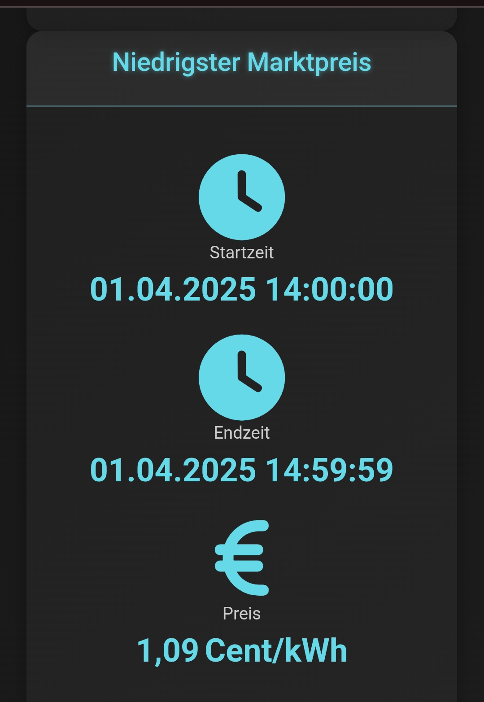
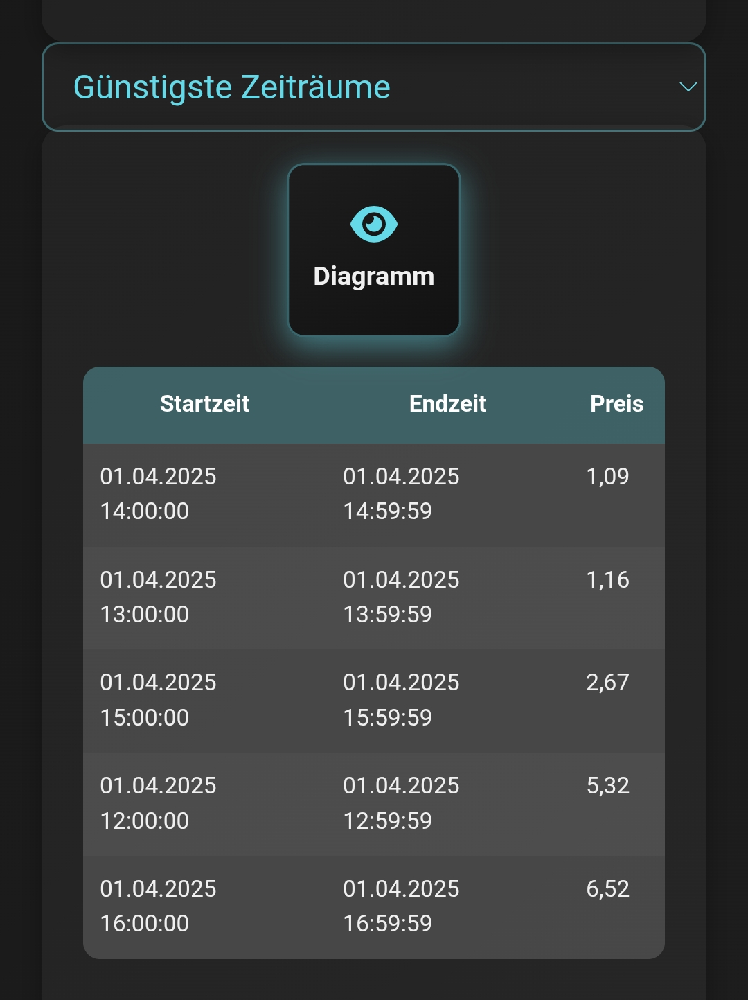

# Zeus Charge Control / Zeus Ladeoptimierung

Zeus Charge Control ist eine Java/Spring-Boot-Anwendung zur Optimierung von Ladeplänen für PV-Batteriespeicher auf Basis dynamischer Marktpreise. Die App integriert Wetter- und Preisdaten, steuert die Batterie über die **Sonnen API v2** und läuft weiter, auch wenn die Batterie zeitweise nicht erreichbar ist (Fehler werden geloggt).

**Systemvoraussetzungen:** Java 17, Spring Boot 2.7.x (aktuell 2.7.18), Battery API erreichbar (Sonnen API v2).

---

## ⚠️ Hinweis: Experimental / Private Use

Dieses Projekt befindet sich in einem **experimentellen Entwicklungsstadium** und ist primär für **private Nutzung, Tests und Lernzwecke** gedacht.

Die Software ist **nicht für den produktiven Dauerbetrieb in sicherheitskritischen oder kommerziellen Umgebungen** vorgesehen.  
Automatisierte Ladeentscheidungen erfolgen konfigurations- und datenbasiert und sollten vor einem produktiven Einsatz sorgfältig geprüft werden.

### 📦 Distribution & Build-Hinweis

Dieses Projekt wird **bewusst ohne vorkompilierte Binaries oder Releases** bereitgestellt.  
Die Anwendung ist **ausschließlich als Quellcode** verfügbar und muss **lokal mit Maven gebaut** werden.

```bash
mvn clean package
````

Die Verantwortung für Build, Konfiguration und Betrieb liegt vollständig beim Nutzer.

---

## Hauptfunktionen

* Batteriestatus-Monitoring: Echtzeit-RSOC mit Visualisierung.
* Marktpreismanagement: Ladefenster nach Preis/Schwellenwerten planen.
* Optimierte Ladezeiten: Günstigste Perioden unter Berücksichtigung des RSOC-Bedarfs.
* Preis- und Ladevisualisierung: Tabellen und Charts.
* Wetterintegration: Forecast (Open-Meteo) beeinflusst Ladeentscheidungen.
* Nachtmodus-Steuerung: Nacht-Leerlauf oder Automatik konfigurierbar.
* Fehlertoleranz: Batteriezugriff-Ausfälle werden protokolliert, App bleibt stabil.

---

## Dynamische Ladeplanung

1. **RSOC-Logik:** Keine Ladung, wenn RSOC ≥ Ziel (z. B. 90 %); bestehende Pläne werden entfernt.
2. **Preisoptimierung:** Auswahl der günstigsten Perioden im Toleranzfenster (z. B. 22:00–06:00).
3. **Nachtfenster:** Bis zu zwei Perioden, dynamisch angepasst an Bedarf.
4. **Tagpufferung:** Optional zusätzliche Tagesfenster, wenn nötig.
5. **Flexibilität:** Toleranz für leicht höhere Preise konfigurierbar.
6. **Konfigurierbarkeit:** Alle Parameter über `application.properties`.

---

## API-Integration

* Marktpreise: aWATTar, Tibber
* Wetter: Open-Meteo (kostenlos für nicht-kommerzielle Nutzung)
* Batterie: Sonnen API v2

---

## Beispielkonfiguration

```properties
battery.target.stateOfCharge=90
marketdata.source=awattar
marketdata.acceptable.price.cents=15
marketdata.price.flexibility.threshold=10
night.start=22
night.end=6
nighttime.max.periods=2
```

---

## Visualisierungen

* Batteriestatus (RSOC)
* Steuerungspanel (Mode/Charging/Night Idle)
* Marktpreise & Ladepläne (Tabellen/Charts)






---

## Verwendete Bibliotheken (Auszug)

* Spring Boot 2.7.x
* Bootstrap 5.3
* Font Awesome 6 (Free)
* jQuery Slim 3.5
* Chart.js + chartjs-adapter-luxon + Luxon

---

## Disclaimer & Haftungsausschluss

### Keine Verbindung zur Sonnen GmbH

Dieses Projekt steht **in keiner Verbindung zur Sonnen GmbH**.
Die Software wurde **nicht von der Sonnen GmbH entwickelt, bereitgestellt oder unterstützt**.

Die Nutzung der **Sonnen API v2** erfolgt ausschließlich auf Basis öffentlich zugänglicher Schnittstellen und Dokumentationen. Alle Marken-, Produkt- und Firmennamen sind Eigentum der jeweiligen Rechteinhaber.

### Haftungsausschluss

Die Inhalte und der Quellcode dieses Projekts dienen **ausschließlich der allgemeinen Information** und stellen **keine fachliche Beratung** dar – insbesondere **keine rechtliche, steuerliche, finanzielle oder energetische Beratung**.

Insbesondere übernimmt der Autor **keine Haftung für Schäden**, die durch **Fehlkonfiguration**, **Fehlinterpretation von Marktdaten** oder **automatisierte Ladeentscheidungen** entstehen.

Die Nutzung der Software erfolgt **auf eigene Verantwortung**.
Eine Haftung für **materielle oder immaterielle Schäden** ist ausgeschlossen, sofern kein **vorsätzliches oder grob fahrlässiges Verschulden** vorliegt.

Es wird keine Gewähr für:

* die Aktualität, Richtigkeit oder Vollständigkeit der Inhalte,
* die dauerhafte Verfügbarkeit externer APIs (z. B. Markt-, Wetter- oder Batterie-Schnittstellen),
* die Eignung für einen bestimmten Zweck

übernommen.

### Open-Source-Hinweis

Dieses Projekt wird als **Open-Source-Software** bereitgestellt. Änderungen, Erweiterungen oder der produktive Einsatz erfolgen auf eigenes Risiko.

---

## Lizenz

Apache License 2.0 (siehe [LICENSE](LICENSE)).

---

# Zeus Charge Control (English)

Zeus Charge Control is a Java/Spring Boot app that optimizes charging schedules for PV batteries based on dynamic market prices. It integrates weather and price data, controls the battery via **Sonnen API v2**, and stays up even if the battery is temporarily unreachable (errors are logged).

**Requirements:** Java 17, Spring Boot 2.7.x (currently 2.7.18), Battery API reachable (Sonnen API v2).

---

## ⚠️ Notice: Experimental / Private Use

This project is in an **experimental stage** and is primarily intended for **private use, testing, and educational purposes**.

The software is **not designed for production use in safety-critical or commercial environments**.
Automated charging decisions are configuration- and data-driven and should be carefully reviewed before any productive deployment.

### 📦 Distribution & Build Notice

This project is **intentionally distributed as source code only**.
No pre-built binaries or releases are provided.

The application must be **built locally using Maven**:

```bash
mvn clean package
```

The user is fully responsible for build, configuration, and operation.

---

## Main Features

* Battery monitoring: real-time RSOC with visualization.
* Market price management: schedule by price/thresholds.
* Optimized timing: cheapest periods considering RSOC need.
* Price and charging visuals: tables and charts.
* Weather-aware decisions via Open-Meteo.
* Night mode control: configurable night idle/automatic.
* Fault tolerance: battery outages are logged; app continues running.

## Dynamic Charging Logic

1. **RSOC logic:** Skip charging if RSOC ≥ target; remove existing plans.
2. **Cheapest selection:** Pick cheapest windows in the tolerance horizon (e.g., 22:00–06:00).
3. **Night windows:** Up to two periods dynamically chosen.
4. **Day buffering:** Optional daytime slots when needed.
5. **Flex thresholds:** Allow slightly higher prices (configurable).
6. **Configurable:** Tune everything via `application.properties`.

## APIs

* Market prices: aWATTar, Tibber
* Weather: Open-Meteo (non-commercial free tier)
* Battery: Sonnen API v2

## Libraries (selection)

* Spring Boot 2.7.x
* Bootstrap 5.3
* Font Awesome 6 (Free)
* jQuery Slim 3.5
* Chart.js + chartjs-adapter-luxon + Luxon


---

## Disclaimer & Limitation of Liability

### No affiliation with Sonnen GmbH

This project is **not affiliated with Sonnen GmbH**.
The software is **not developed, provided, or endorsed by Sonnen GmbH**.

The use of the **Sonnen API v2** is based solely on publicly available interfaces and documentation. All trademarks, product names, and company names remain the property of their respective owners.

### Limitation of Liability

The contents and source code of this project are provided **for general informational purposes only** and do **not constitute professional advice**, including but not limited to **legal, tax, financial, or energy-related advice**.

Use of this software is **entirely at your own risk**.
Liability for **material or immaterial damages** is excluded unless caused by **intent or gross negligence**.

No warranty is given regarding:

* accuracy, completeness, or timeliness of the information,
* availability or reliability of external APIs (e.g. market, weather, battery),
* fitness for a particular purpose

In particular, the author assumes **no liability for damages** resulting from **misconfiguration**, **misinterpretation of market data**, or **automated charging decisions**.

### Open-Source Notice

This project is provided as **open-source software**. Any modifications, extensions, or productive use are carried out at the user's own risk.

---

## License

Apache License 2.0 (see [LICENSE](LICENSE)).